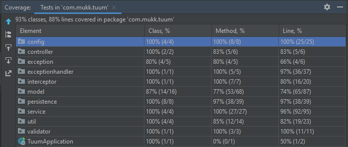

# Tuum test assignment

This is a README, which includes responses to the questions which were asked in test assignment.


### Source code

You are looking at the source code, which is a single SpringBoot application.

Technologies used for implementation:
* Java 11
* Gradle 6.8.3
* SpringBoot 2.7.4
* MyBatis (version should be 3.5.5, it comes from mybatis-spring-boot-starter:2.1.3)
* RabbitMQ amqp-client 5.16.0
* Postgres 13
* MyBatis Generator 1.4.1
* Springfox Swagger UI 3.0.0
* Lombok

Technologies used for testing:
* jUnit 5
* Testcontainers 1.17.4
* REST Assured 4.2.0

Test coverage:


### How to run the application locally?

The easiest way to run this application locally for this demo, would be with Docker.

Steps to follow for demo (this has been tested on Windows 10 since I have access to that):
1) Navigate to project root folder in terminal.
2) Run `./gradlew bootJar` to build the JAR file.
3) Run `docker-compose up` to startup JAR, Postgres and RabbitMQ.
4) Wait for services to come up and application will be accessible on `localhost:8080`.
5) Head over to `http://localhost:8080/swagger-ui/index.html` to see the Swagger for implemented endpoints.


To run the application for development purposes, you should not follow previous steps.

Steps to follow for development:
1) Navigate to project root folder in terminal.
2) Run `docker-compose -f docker-compose-dev.yml up` to start up RabbitMQ and Postgres.
3) Optional! Run `./gradlew mbGenerate`, if you have done any DB structure changes and want to generate new entities.
4) Run `./gradlew bootRun`.
5) Application will start on `localhost:8080`.

### Dockerfile and docker-compose.yml

As mentioned in the previous paragraph, docker-compose is used to boot up the application locally
with Postgres and RabbitMQ (for demo, not production ready yet).

For development there is a separate `docker-compose-dev.yml` file, which starts up RabbitMQ and Postgres only.
Application still needs to be started up, using `gradlew bootRun`, for example.

### Explanation of important choices (and problems that lead me to these choices)

1) I decided to use MyBatis with XML-file approach. I have not worked with MyBatis too much before and MyBatis documentation
did not help me out too much, neither did the rest of the Internet for XML-based approach.
So I had difficulties setting it up. Therefore, I decided to go with XML approach, because that seemed more logical.


2) I decided to use MyBatis generator to make it easy to keep entities in code and in DB in sync. It automatically
generates entities based off database structure.


3) For MyBatis, I did not figure out how to use TypeHandlers properly. This resulted in some workarounds, such as 
I could not generate correct data types for every property in entities. For example, database generates
primary key for every entry automatically, but data type in entity is "String", not "UUID". If I did define it as uuid
in database, generator would generate it as "Object", which would have been worse than "String".
Same issue for enums, when I tried defining an enum in database, but it would pop-up as "String" or "Object" in code, 
I decided to keep it as "String" in the end.


4) RabbitMQ message publishing. I decided to create a pointcut aspect, which would automatically call RabbitService, which sends
a message on database insert and update. I wish that I could have implemented it in a way,
that it triggers when DAO interface method is called, but it did not work out. Therefore, it triggers
when a service wrapper method for database insert/update is invoked, like here:
```java
public int insertAccount(AccountEntity entity) {
        return accountDao.insert(entity);
    }
```

5. I have created 3 tables in DB: account, balance and transaction. Along those, I also have 
3 separate DAOs (interfaces + XML files for MyBatis mapping) and 3 separate services.
To keep logic more separated and responsible for one thing only (account service for account logic, etc.), 
each service can call only respective DAO directly.
For example AccountService can call only AccountDAO directly. If it needs access to BalanceDAO, it does
it through BalanceService.


6. I have hardcoded all the secrets as of now, because this is here just for local demo, nothing more.
I could pass values using an env file to docker-compose, but for me, it seemed out of the scope for this test assignment.


### Estimation of how many transactions app can handle per second

My development machine (a laptop) has Intel i7-8565U CPU and 24GB of ram.

Locally I can see that creation of one transaction takes about 15-20ms. So, if it would be constantly the same,
then in 1 minute it could handle 50 to 66 transaction requests. But let´s factor in that there is more load on server
due to actually handling requests constantly, I will reduce the number down to <b>40 transaction creations per second</b>.

### Considerations for scaling applications horizontally

Firstly, multithreading should be used. Right now when endpoint is called simultaneously and breakpoint 
is set which suspends the tread, other request is also waiting behind that.

If multiple threads were accepting traffic, it would already improve performance.

Eventually I would have to make changes to infrastructure - separate server and DB to different machines.
It would increase both, server and DB performance.

When that is not enough, servers could be spread across multiple physical machines. Then a load-balancer (such as NGINX)
should be introduced, which would spread the load between all the machines.

